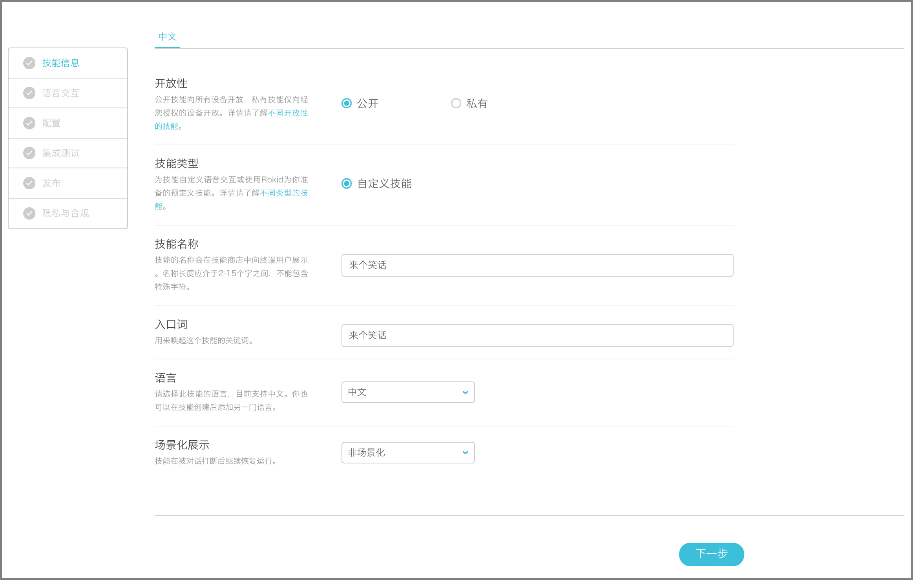

## 填写技能信息

**如下图所示：**

### 设置技能的开放性
填写技能信息的第一步，就是设置所建技能的开放性。您可以设置创建的技能为**`公开技能`**，向所有设备开放；也可以设置为**`私有技能`**，仅面向经过您授权的设备开放。

**`公开技能`**：公开属性的技能将会对所有搭载 Rokid 语音解决方案的设备开放，终端用户可以通过技能商店轻松开启您开发的技能。

**`私有技能`**：私有属性的技能无法向所有用户开放，仅向经过您授权的设备开放。

###选择技能类型：自定义

**`自定义技能`**支持专业开发者设计符合自己业务场景的语音交互流程和业务处理逻辑，创建出功能强大的技能。

**注意**：此处用户只能选择**`自定义技能`**；若要调用**`预定义技能`**，请您在下一步设置【语音交互】时，点击【预定义语音交互】，然后选择您想要的【预定义语音交互配置】，点击【引用】按钮即可。具体操作见：[语音交互](voice-interaction.md)

### 技能名称

技能的名称会在技能商店中向终端用户展示。名称长度应介于2-15个字之间，不能包含特殊字符。

### 入口词

**`入口词(唤醒词)`**是用来唤醒技能的词语。如果用户想使用非 Rokid 官方技能，必须对若琪设备说：“若琪，打开‘**入口词**’”，技能才会被调用。

> 例如：使用「来个笑话」这个技能前，必须对若琪说：“若琪，打开来个笑话” ，该技能才会被启用。

### 场景化展示：选择非场景化
技能在被对话打断后仍能继续恢复运行，即为**`场景化展示`**，否则即为**`非场景化展示`**。目前，非Rokid官方开发者目前只能选择非场景化展示。

> 比如播放音乐时，询问天气，天气播报完成以后仍会继续播放音乐。则该播放音乐的技能为场景化技能。 天气播报技能为非场景化技能。

[下一步](voice-interaction.md)

