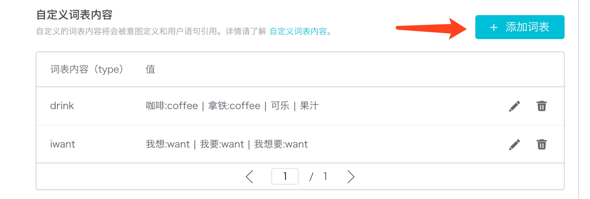
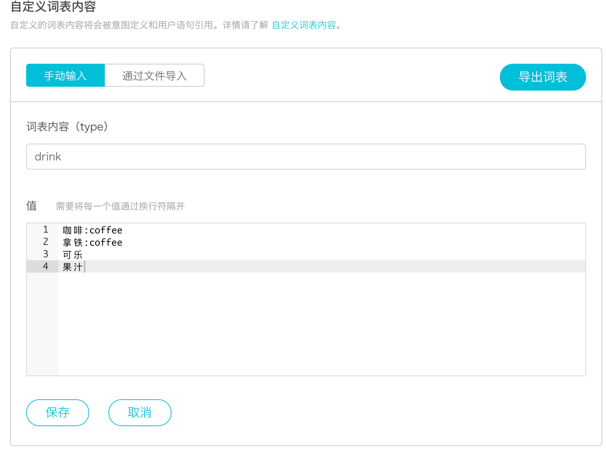
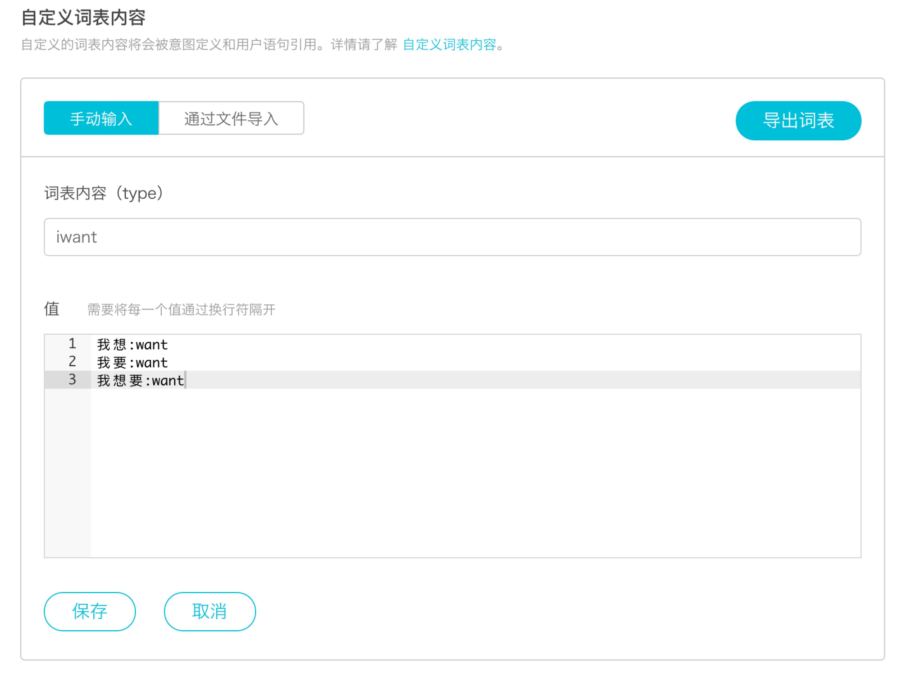
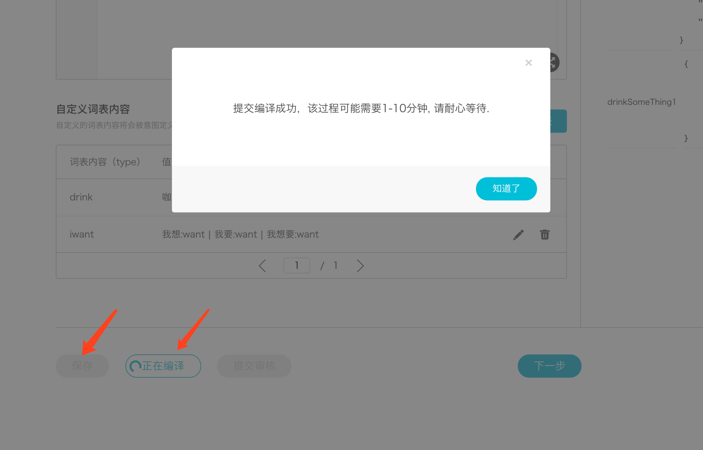

## 词表

词表是用户与技能交互过程中的一个重要概念，是指某领域词汇的集合。当用户询问北京天气怎么样时，其中北京是城市信息，将北京、天津、上海等所有城市信息集合起来就组成了中国城市的词表。
目前开放平台有自定义词表和预定义词表
### 预定义词表
### 1. 数字、日期和时间相关
数字的预定义词表。

| 自定义词表类型  | 简介           | 支持语言 |
| ------------- | :-------------:| :-----:|
| ROKID.NUMBER | 阿拉伯数字及汉语数字 |   中文 |
| ROKID.DATETIME_ZH | 某年某月某一天      |   中文 |
| ROKID.RECENT_ZH | 「近期」的时间词汇    |   中文 |
| ROKID.YEAR_ZH | 以「年」为单位的时间词汇 |  中文 |
| ROKID.MONTH_ZH | 以「月」为单位的时间词汇 |  中文 |
| ROKID.DAY_ZH | 以「日」为单位的时间词汇|   中文 |
| ROKID.HOUR_ZH | 以「小时」为单位的时间词汇 |  中文 |
| ROKID.MINUTE_ZH | 以「分钟」为单位的时间词汇  |   中文 |
| ROKID.SECOND_ZH | 以「秒」为单位的时间词汇    |   中文 |
| ROKID.TIME_ZH | 具体的时间或时间段    |   中文 |

#### ROKID.DATE

日期解析，将表示日期的文字转换成utc date格式，格式参照日期格式国际标准ISO-8601。
对于一个特定的日期，如“今天”、“现在”、“一月十五日”，将会转换成一个完整的日期：2018-01-15
对于一个特定的星期，如“这周”、“下周”，将会转换成:2018-W3
对于一个特定的周末，如“这周末”，将会转换成：2018-W3-WE
对于一个特定的月份，并且没有指定日期，将会转换成：2018-01
对于一个特定的年份，将会转换成：2018
对于一个特定的十年期，将会转换成：201X
对于一个特定的季节，将使用SP表示春季，SU表示夏季，FA表示秋天，WI表示冬季。

ROKID.DURATION
时间段解析，将表示周期的文字转换成utc duration格式，格式参照时间段格式国际标准ISO-8601。基本格式PnYnMnDTnHnMnS，P表示这是一个周期，n是表示紧接的时间单位的量词，比如，P3D表示3天。T表示这个周期是一个时间周期，而不是日期周期。
“十分钟”：PT10M
“五小时”：PT5H
“三天”：P3D
“四十五秒钟”：PT45S
“八周”：P8W
“十年”：P10Y
“五小时十分钟”：PT5H10M
“两年三小时十分钟”：P2YT3H10M

ROKID.TIME
时间解析，将表示时间的文字转换成utc time格式，格式参照时间格式国际标准ISO-8601。
“中午”、“正午”：12:00
“午夜”：00:00
“六点”：06:00
“早上五点”、“凌晨五点”：05:00
“下午二点三十”：14:30
“晚上二十三点五十九分”：23:59
“早上”：MO
“现在”：21:16

#### 不支持

1. 农历不支持
2. “又”不支持
3. 五月3不支持，需要带单位
4. 繁体字，如“仨”不支持

#### DATE问题
##### 世纪：

* 20世纪（19）
* 二十世纪（19）
* 二十一世纪（20）
      
##### 年代：

* 只支持：五十年代，六十年代，七十年代，八十年代，九十年代
* 五十年代，五零年代，50年代（195X）
* 六十年代，六零年代，60年代（196X）
* 七十年代，七零年代，70年代（197X）
* 八十年代，八零年代，80年代（198X）
* 九十年代，九零年代，90年代（199X）

##### 世纪+年代：

* 二十一世纪初（200X）
* 21世纪初（200X）
* 二十世纪10年代（191X）
* 二十世纪一零年代（191X）
* 二十世纪一十年代（191X）
* 二十世纪20年代（192X）
* 二十世纪30年代（193X）
* 二十世纪40年代（194X）
* 二十世纪50年代（195X）
* 二十世纪60年代（196X）
* 二十世纪70年代（197X）
* 二十世纪80年代（198X）
* 二十世纪90年代（199X）

##### 公元+世纪：

* 公元前三世纪（-2）
* 公元三世纪（2）
        
##### 天：

* 三号（2018-05-03）
* 3日（2018-05-03)
* 三日（2018-05-03）
* 3号（2018-05-03，月份不变，变更日期）
       
##### 月份：

* 五月份（2018-05）
* 5月（2018-07）
        
##### 月份+天（带单位）：

* 五月三日（2018-05-03）
* 五月三号（2018-05-03）
* 五月3日（2018-05-03）
* 5月三日（2018-05-03）
* 5月3日（2018-05-03）

##### 月份+天（不带单位）：

* 五月三（命中，utc无返回，应该命中：2018-05-03）
* 五月3（命中，utc无返回，应该命中：2018-05-03）
* 5月三（命中，utc无返回，应该命中：2018-05-03）
* 5月3（命中，utc无返回，应该命中：2018-05-03） 
        
##### 年：49年以前命中结果都是20开头，50以后则是19开头

* 1980年（1980）
* 一九八零年（1980）
* 89年（1989）
* 八九年（1989）
* 四九年（2049）
* 零零年（2000）
* 零一年（2001）
* 00年（2000）
* 01年（2001）
* 今年（2018）
* 明年（2019）
* 去年（2017）
* 后年（2020）
* 前年（2016）

##### dateTime之前|之后：

* 五天前（2018-05-13，当前日期-5天）
* 三个月前（2018-02，当前月份-三个月）
* 四年前（2014，当前年份-4年）
* 五十年后（2068，当前年份+50年）
* 五周后（2018-W25，当前周数+5）
* 三年五个月四周三天前（2014-W16）
* 三年零五个月四周零三天前（2014-W17）
* 5年前（2013）
       
##### 年+季节

* 1980年冬天（1980-WI）
* 一九八零年夏天（1980-SU）
* 89年秋天（89-FA）
* 春天（2018-SP）
* 冬天（2018-WI）
* 秋天（2018-FA）
* 夏天（2018-SU）
* 今年秋天（2018-FA）
* 明年冬天（2019-WI）
* 去年夏天（2017-SU）
* 后年春天（2020-SP）
* 前年冬天（2016-WI）

##### 年+月份：

* 一九八零年五月（1980-05）
* 八九年五月（1989-05）
* 1980年5月（1980-05）
* 今年五月（2018-05）
* 明年五月（2019-05）
* 去年6月（2017-06）
* 后年三月（2020-03）
* 前年九月份（2016-09）

##### 年+月+日：

* 一九八零年五月三日（1980-05-03）
* 一九八零年三月三号（1980-03-03）
* 1980年5月3日（1980-05-03）
* 八零年五月三日（1980-05-03）
* 今年五月三日（2018-05-03）
* 明年五月三日（2019-05-03）
* 去年6月四日（2017-06-04）
* 后年八月五日（2020-08-05）
* 前年五月三号（2016-05-03)
* 前年五月三日（2016-05-03）
* 一九九八年三月四（不支持，必须带单位)

##### 对于一个特定的日期：

* 今天（当前完整的日期：2018-05-02）
* 明天（当前完整的日期+1：2018-05-03）
* 后天（当前完整的日期+2:2018-05-04）
* 前天（当前完整的日期-2:2018-04-30）
* 昨天（当前完整的日期-1：2018-05-01）
* 大前天（当前完整的日期-3：2018-04-29）
* 大后天（当前完整的日期+3: 2018-05-05）

##### 对于一个特定的星期（支持：周，星期，礼拜）：

* 这周（2018-W20，实际周数)
* 上周（2018-W19，实际周数-1)
* 下周（2018-W21，实际周数+1)
* 本周（2018-W20，实际周数)
* 上上周（2018-W18，实际周数-2)
* 下下周（2018-W22，实际周数+2）
* 三周后（2018-W23，实际周数+3）
* 这周二（2018-W20-2）
* 本周六（2018-W20-6）
* 下周五（2018-W21-5）
* 上周三（2018-W19-3）
* 上上周一（2018-W18-1）
* 下下周天（2018-W22-7）
* 今年第三周（应该是今年第三周：2018-W03）

##### 对于一个特定的周末（星期六和星期日）：

* 这周末（2018-W20-WE)
* 本周末（2018-W20-WE）
* 下周末（2018-W21-WE)
* 上周末（2018-W19-WE）
* 上上周末（2018-W18-WE)
* 下下周末（2018-W22-WE)

##### 对于一个特定的月份：

* 这个月（2018-05）
* 这月（2018-04）
* 本月（2018-04）
* 下个月（2018-05）
* 上个月（2018-03）
* 下下个月（2018-06）
* 上上个月（2018-02）
        
##### 对于一个特定的节假日：节假日只支持固定节假日

* 元旦（2018-01-01）
* 国庆节（2018-10-01）
* 清明节（2018-04-05），清明节不是固定在4月5日，比如2020年是4月4日
* 劳动节（2018-05-01）
* 教师节（2018-09-10）
* 儿童节（2018-06-01）
* 建军节（2018-08-01）
* 建党节（2018-07-01）
* 春节（不支持）
* 除夕夜（不支持）
* 元宵节（不支持）

##### 年+节日：不支持

#### ROKID.DURATION
##### 周

* 三周（P3W）
* 3周（P3W）
* 3个礼拜（P3W）
* 三个礼拜（P3W）
* 3星期（P3W）
* 三星期（P3W）

##### 年

* 三年（P3Y）
* 3年（P3Y）
* 一零年（P10Y）
* 一十年（P10Y）
* 三十万年（P300000Y）

##### 月

* 三月（P3M）
* 3个月（P3M）
* 3月（P3M）

##### 天

* 三天（P3D）
* 2天（P2D）
* 3日（P3D）

##### 时

* 三个小时（PT3H）
* 七二小时（PT72H）

##### 分

* 六十分钟（PT60M）
* 60分钟（PT60M）
* 六零分钟（PT60M）
* 一刻钟？(不支持)

##### 秒 （四五秒是否应该理解为4，5秒，而不是45秒？目前很难区分）

* 45秒（PT45S）
* 四十五秒（PT45S）
* 四五秒（PT45S）

##### 年+月

* 一年二月（P1Y2M）
* 一年零两个月（不支持）
* 一年零两月（P1Y2M）
* 一年又两月（不支持）
* 一年一二月（P1Y12M）
* 一年十二月（P1Y12M）
* 一年零一零月（P1Y10M）
* 一年零一十月（P1Y10M）

##### 年+月+天

* 一年零两月零三天（P1Y2M3D）
* 一年零一十月零一零天（P1Y10M10D）
* 五年零五天（P5Y5D）
* 十月34天（P10M34D）

##### 年+月+天+时

* 一年零两月零三天二十小时（P1Y2M3DT20H）

##### 年+月+天+时+分

* 7年13月30天8小时45分钟（P7Y13M30DT8H45M）

##### 年+月+天+时+分+秒

* 7年13月30天8小时45分钟90秒（P7Y13M30DT8H45M90S）

#### ROKID.TIME

* 中午（12:00）
* 正午（12:00）
* 午夜（00:00）
* 上午（MO）
* 晚上（NI）
* 下午（AF）
* 早上（MO）
* 傍晚（EV）
* 六点（06:00）
* 六点半（06:30）
* 8时（08:00）
* 三点十二分（03:12）
* 9点三十一分四十一秒（09:31:41）
* 下午6点钟（18:00）
* 下午六点（18:00）
* 上午6点（06:00）
* 早上8点（08:00）
* 晚上8点（20:00）
* 傍晚七点（19:00）
* 中午一一点三十分（11:30）
* 早上10点（10:00）
* 凌晨三点（03:00）
* 三个小时后（16:37,当前时间+3个小时）
* 仨小时五分钟以后（仨不支持，繁体仨）
* 五分二十六秒前（13:32:28，当前时间+五分二十六秒）
* 一个小时以后（14:38，前时间+一个小时）
* 十分钟后（13:48，前时间+十分钟）
* 三秒前（13:38:55，前时间+三秒）

### 2. 常用名词词汇
常用名词的预定义词表。

| 自定义词表类型  | 简介           | 支持语言 |
| ------------- | :-------------:| :-----:|:-----:|
| ROKID.COUNTRY_ZH | 国家 |   中文 |
| ROKID.WORLDCITY_ZH | 世界城市 |   中文 |
| ROKID.CN_PROVINCE_ZH | 中国省份 |   中文 |
| ROKID.CN_CITY_ZH | 中国城市 |   中文 |
| ROKID.CN_ARE_ZH | 中国县／区 |   中文 |
| ROKID.ANIMALYEAR_ZH | 生肖年  |   中文 |
| ROKID.ERAYEAR_ZH | 干支年  |   中文 |
| ROKID.ZONE_ZH | 早上、晚上等某个时间段的词汇   |   中文 |
| ROKID.MOVIE | 电影   |   中文 |


### 3. 其他词汇

其他词汇的预定义词表。

| 自定义词表类型  | 简介           | 支持语言 |
| ------------- | :-------------:| :-----:|:-----:|
| ROKID.AH_ZH | 语气词  |   中文 |
| ROKID.YES_ZH | 表示「肯定」的词汇  |   中文 |
| ROKID.NO_ZH | 表示「否定」的词汇  |   中文 |
| ROKID.NEW_ZH | 描述「新」的词汇  |   中文 |

### 自定义词表

在Rokid开发者社区提供的预定义词表之外，开发者可以自定义自己的词表内容。在创建技能过程中的语音交互环节进行添加自定义词表内容，开发者可以把任何可以抽象的内容定义为词表，并在用户语句中通过$ + 词表名称进行调用。比如当您希望定义以下几种用户语句时：
```
我想喝咖啡
我要喝咖啡
我想要喝咖啡
我要喝可乐
我想喝果汁
```
可以抽象出两个词表：
* iwant

```
我想
我要
我想要
```
* drink

```
咖啡
可乐
果汁
```
并通过以下语句统一表达：
```
$iwant喝$drink
```
如果开发者想把多个词表内容做统一的输出，如"咖啡"，"拿铁"统一输出为："coffee",则可以把词表drink修改为：

```
咖啡:coffee
拿铁:coffee
可乐
果汁
```

配置过程如下：

* 添加词表drink和iwant








配置完毕词表并且保存以后，进行意图定义，定义内容如下：
```json
{
	"intents": [
		{
			"intent": "Hello_Developer",
			"slots": [
				{
					"name": "drinkSomeThing1",
					"type": "drink"
				},
				{
					"name": "drinkSomeThing2",
					"type": "drink"
				}
			],
			"user_says": [
				"$iwant喝$drinkSomeThing1和$drinkSomeThing2",
				"$iwant喝$drinkSomeThing1"
			]
		}
	]
}
```


点击保存并且点击开始编译



等待编译完毕以后就可以进行语义测试。


### 特别说明
一个词表内容可以被多个不同的词表名称引用，用于把同一类的值输出到不同的应用场景中。比如在下例中，ROKID.NUMBER_ZH可以被不同的词表名称引用多次，在用户说出两小时十五分钟三十六秒的时候，能够输出
```
slots":{"hour":"两","min":"十五","sec":"三十六"}

 "intents": [
  {
          {
            "intent": "time",
            "slots": [
                {
                    "name": "hour",
                    "type": "ROKID.NUMBER_ZH"
                },
                {
                    "name": "min",
                    "type": "ROKID.NUMBER_ZH"
                },
                {
                    "name": "sec",
                    "type": "ROKID.NUMBER_ZH"
                }
            ], 
    "user_says":[
       "$hour小时",
       "$min分钟",
       "$sec秒",
        ]
  }
 ]
}
```

#### **一个技能中，所有词表内容的值的总数，不能超过10万个**。


