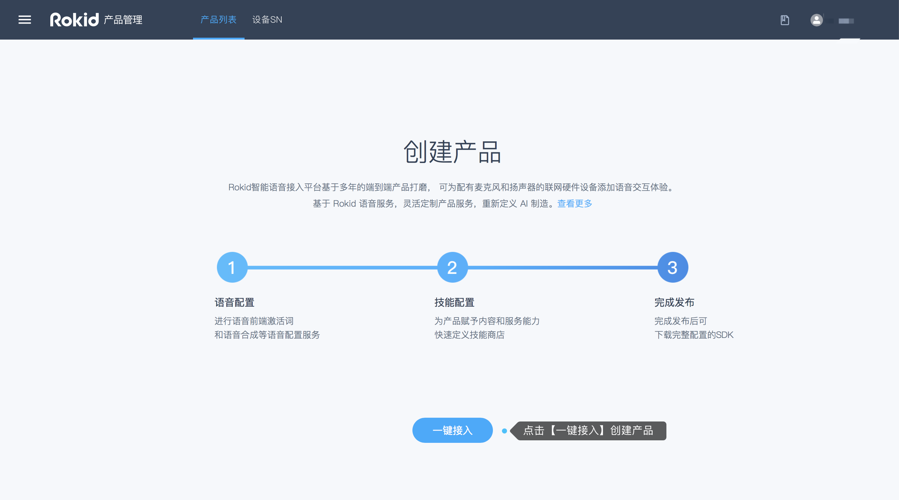
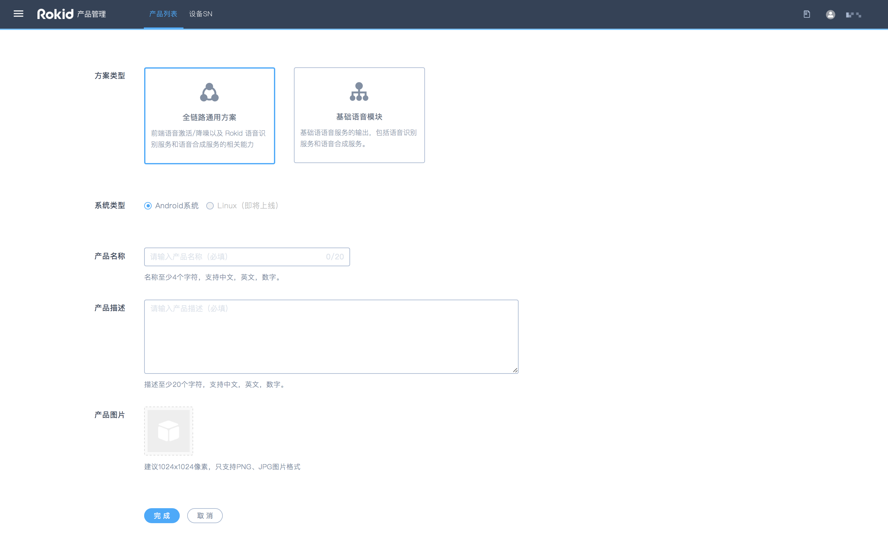
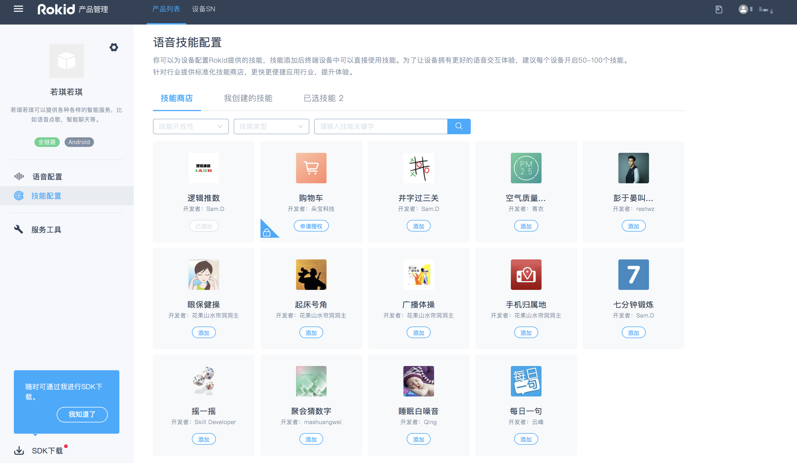
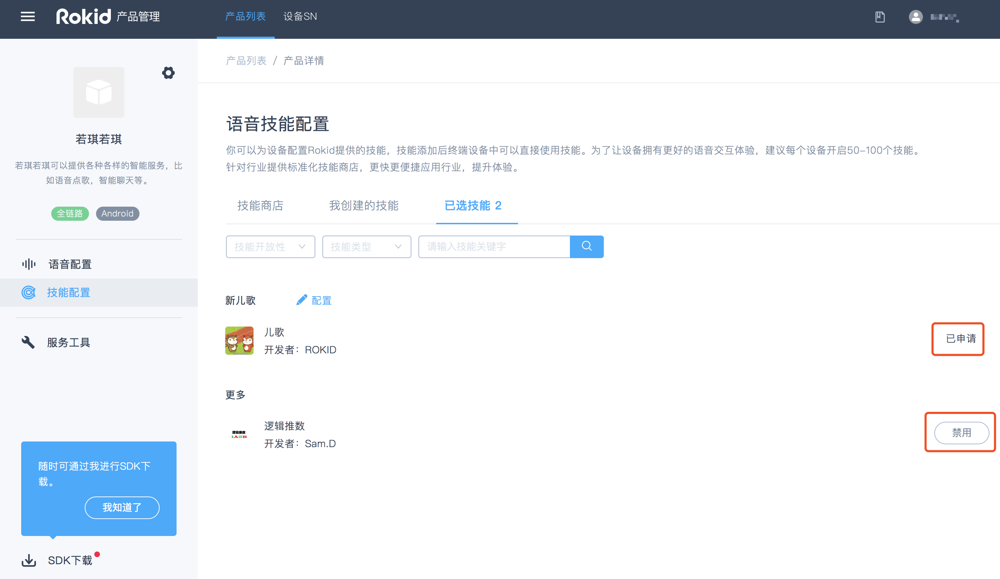
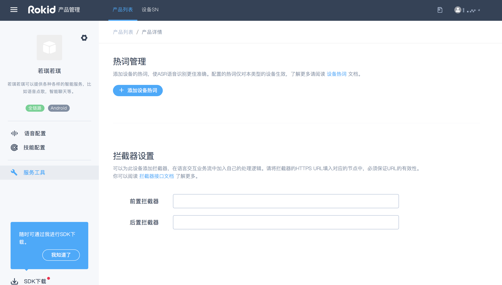

##创建和配置产品

###Step1:登录平台账号（若尚未有账号请先注册）

要使用Rokid开放平台的语音整体方案，请先点击[Rokid开发者社区](https://developer.rokid.com/#/)首页右上方的【登录】按钮，登录Rokid开放平台。如果未有账号，则点击旁边的【注册】按钮进行注册。如下图所示。

登录以后，即进入了Rokid开放平台的控制台。在控制台选择【语音接入】，即可开始使用语音接入工具。如下图所示。

###Step2：创建产品

产品是指您想要接入Rokid语音服务的一种设备，一个产品只对应一种语音配置。当您想要实现多种语音效果的时候，需要创建多个产品。

在上一步点击【语音接入】后，就可以进入创建产品的页面。

- 首次创建产品，可以查看到【创建流程】，点击【一键接入】即可进行创建产品。 如下图所示。
  

- 若账号下已有创建过的产品，则可以点击页面右上角的【一键接入】创建新的产品。如下图所示。

  

####填写产品基本信息

需要填写的产品基本信息，包括：【方案类型】、【系统类型】、【产品名称】、【产品描述】、【产品图片】。

**注意：**【方案类型】分为 [**全链路通用方案**](/rokid-vsvy-sdk-docs/fullLink/introduce.md) 和 [**基础语音模块**](/rokid-vsvy-sdk-docs/speechTTS/introduce.md) 两种。两者的主要区别是：全链路方案会包含前端模块（拾音方式和mic阵列），基础语音模块不包含前端模块（拾音方式和mic阵列）。

### Step3：配置产品

####1、语音配置

#####1）前端语音配置

可根据硬件产品选择【拾音方式】、【麦克风阵列】，并进行【激活词】的设置。如下图所示。

######激活词

**`激活词`**也即**`唤醒词`**，默认为若琪若琪，该激活词已经进行训练，唤醒率比较高，测试时为了保障效果建议使用若琪若琪。

设置自定义激活词请单击**`激活词`**后面的第一个输入框进行编辑；**`激活词`**支持3-5个汉字，不建议使用拼音相同的叠字，**`激活词`**的评分需在3星以上才能保存。

若您选择了自定义**`激活词`**，为了提高唤醒率，建议联系商务(商务邮箱：rokidopen@rokid.com)申请数据训练。

#####2）语音合成配置

当前页面下拉可以配置语音合成。目前只支持【若琪声音-普通话】的调用，其他合成音暂时只能进行在线试听，个性化配置调用会在后期上线。 

####2、技能配置

接下来，可以进行技能的添加和申请。

#####技能分类

Rokid平台上的技能根据开放性的不同，可以分为**`公开技能`**和**`私有技能`**。

<table>
    <tr>
        <th>技能分类</th>
        <th>技能描述</th>
    </tr>
    <tr>
        <td width="30%" align="center">公开技能</td>
        <td width="70%">公开技能将会对所有搭载Rokid语音解决方案的设备开放，用户可以通过技能商店轻松开启公开技能</td>
    </tr>
    <tr>
        <td width="30%" align="center">私有技能</td>
        <td width="70%" word-wrap: break-word;word-break:break-all;>私有技能无法向所有用户开放，仅针对经过授权的企业或个人的特定类型的设备开放。用户需要在被授权的设备上才能够使用私有技能。</td>
    </tr>
</table>

#####技能配置页面介绍

技能配置页面，共有【技能商店】、【我创建的技能】、【已选技能】三个选项卡。

######技能商店

【技能商店】是平台展示各类技能的地方 。目前只展示公有技能和rokid私有技能 。您可以添加公有技能，也可以添加自己创建的技能，但是添加rokid私有技能需要联系商务（商务邮箱：rokidopen@rokid.com）授权。

若您想要添加自己创建的技能，目前有两种方法： 一种是在自己创建的技能页面的发布页面，添加设备typeid，若为公有技能，添加设备id后即可生效，若为私有技能，需前往语音接入的服务配置页面，接受授权。另一种是在语音接入的服务配置页面添加自己创建的技能 。

######我创建的技能

【我创建的技能】为当前账号创建的已发布技能。

######已选技能

【已选技能】为当前账号通过技能商店添加申请的以及自行创建的所有技能。该选项卡下，您可以查看申请技能的状态，以及选择启用或禁用某项技能。

#####具体配置操作

- 公有技能可以直接进行添加。

- 页面上展示的Rokid自有技能，您可以在页面上提出申请，由 **商务**（商务邮箱：rokidopen@rokid.com）同意授权后即可使用。

- 技能配置页面上未显示的Rokid自有技能（系统技能），如有需要，请您提供**typeID**（typeID是该类型产品的唯一标识），然后由商务 （商务邮箱：rokidopen@rokid.com）协助进行人工授权，授权后您同意授权即可使用。

  **注意**：添加的系统技能，需要设备厂商进行二次开发。

  > 如：系统音量、系统电量、系统设置、系统灯光、系统升级、系统powermanager（休眠指令）、系统语音开关、系统引导、系统蓝牙、喜马拉雅、喜马拉雅电台、喜马拉雅故事、喜马拉雅儿歌等。 

####3、服务工具配置

服务工具的配置，包括热词和拦截器配置。热词主要为了提升识别率；拦截器主要适用于兜底聊天和技能家居服务。 具体参照以下指南：

[热词管理接入指南](https://developer.rokid.com/docs/5-enableVoice/rokid-vsvy-sdk-docs/important-concept.html)

[拦截器设置接入指南](https://developer.rokid.com/docs/3-ApiReference/rokid-interceptor.html)

