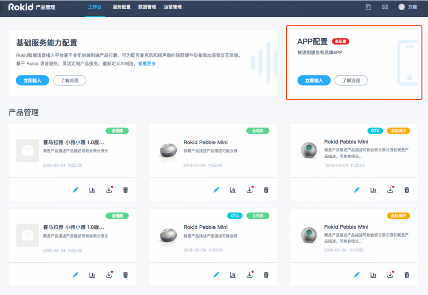
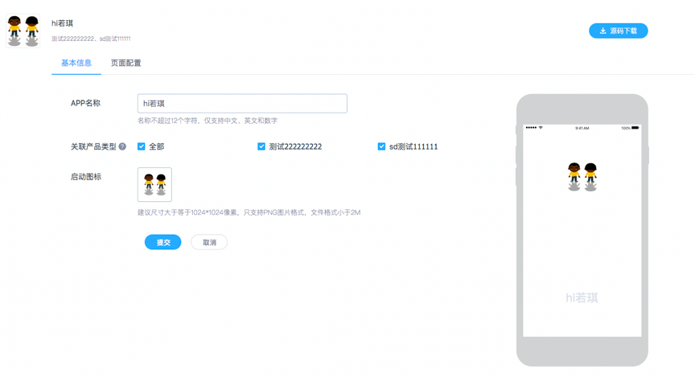
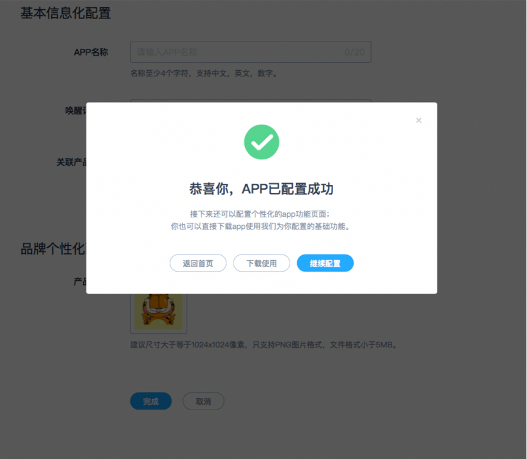
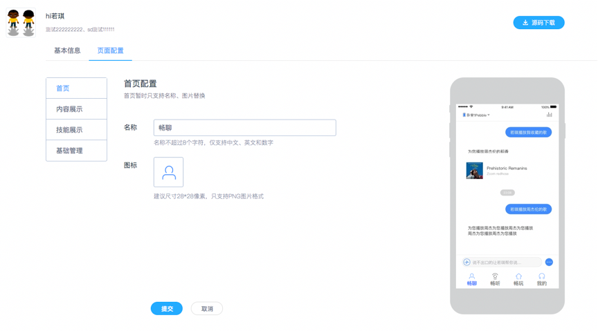
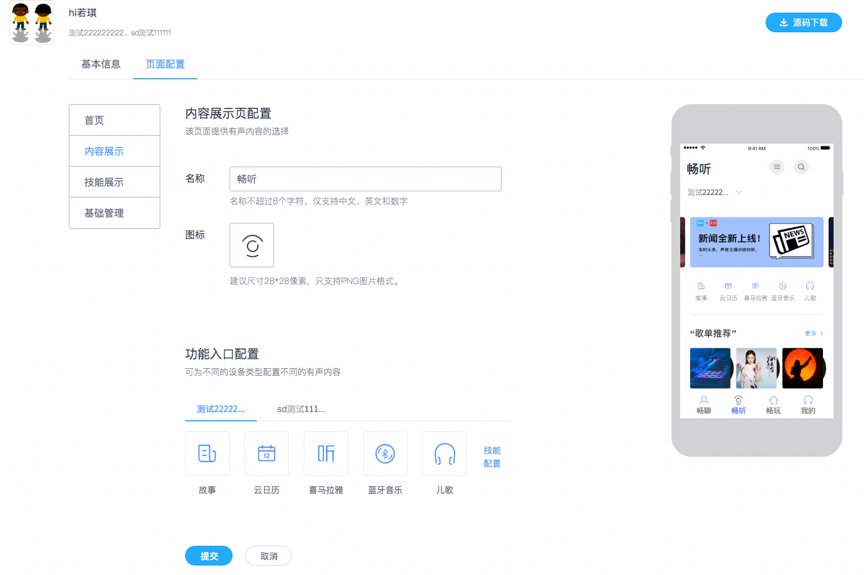
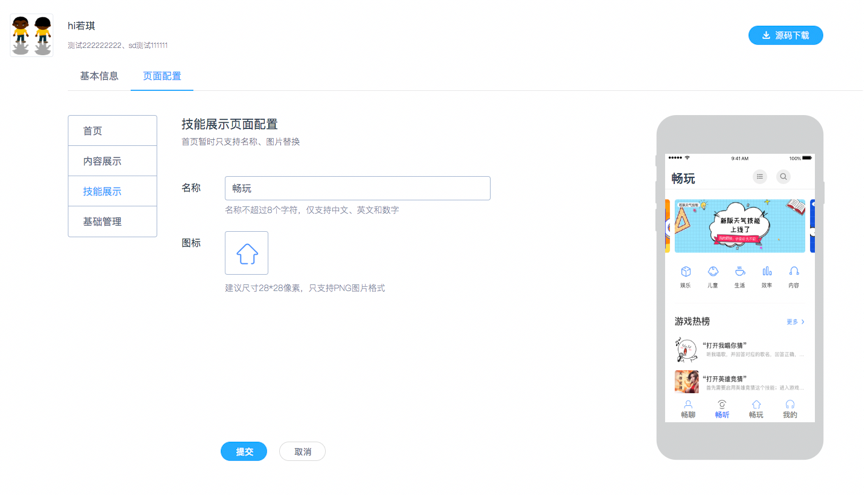
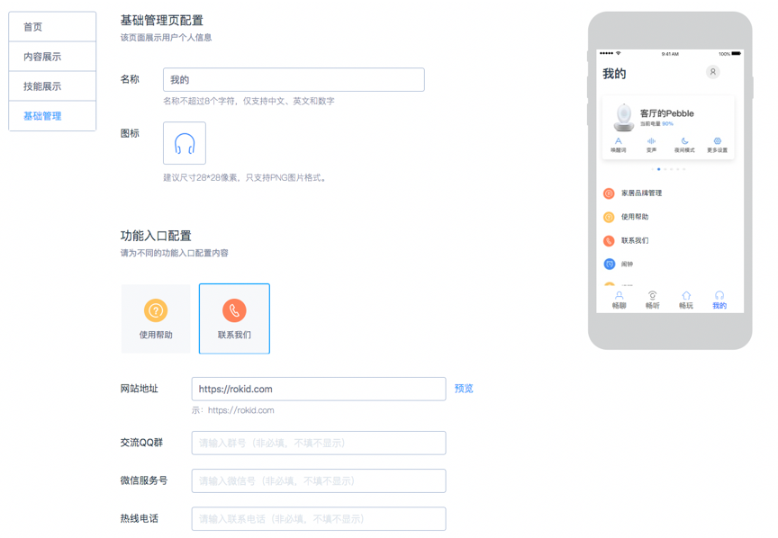
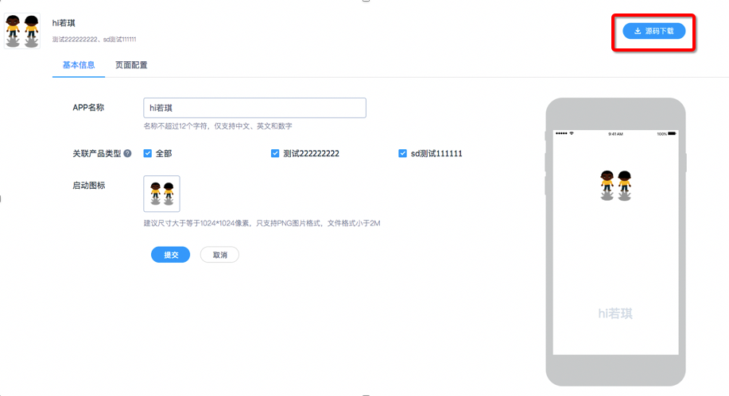
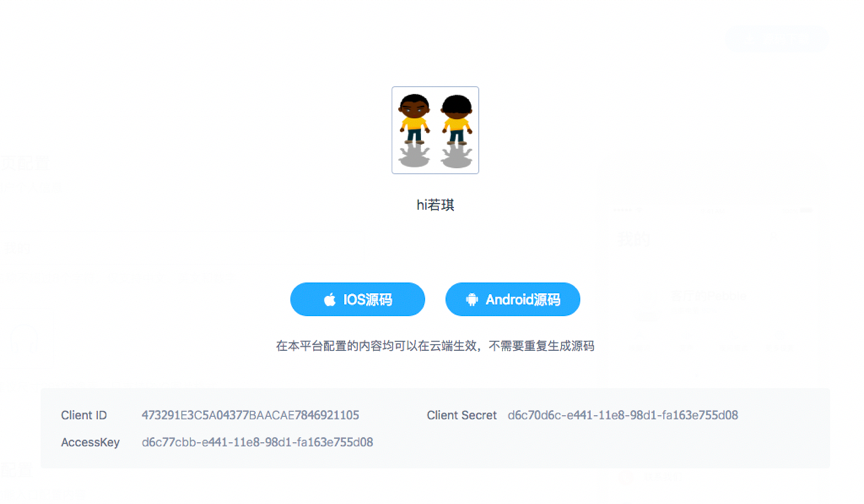

## 目录

ROKID 公版 APP 是可以在 ROKID 开放平台进行配置，且云端生效，并提供 APP 工程 下载的产品服务，用户可以在 APP 工程中进行开发以满足自己的个性化 UI 需求。

备注：该功能需要联系商务（（商务邮箱：rokidopen@rokid.com））进行申请，

* [一、基本信息配置](#一、基本信息配置)
* [二、页面配置](#二、页面配置)
* [三、源码下载](#三、源码下载)

  
### 一、基本信息配置

#### 1. 登录平台账号

**若没有账号请先注册，再登录**

使用Rokid开放平台的语音整体方案，请先点击“[Rokid开放平台](https://developer.rokid.com/#/)”首页右上方的【登录】按钮，登录“Rokid开放平台”。如果未有账号，则点击旁边的【注册】按钮进行注册。如下图所示。

登录后，进入“Rokid开放平台”的控制台。首先阅读《开发者社区服务协议》，同意该协议则勾选【同意并接受该协议所有内容】，点击【确定】。如下图所示。

在【语音整体方案】板块，点击【立即接入】，即可开始使用语音接入工具。如下图所示。

#### 2. app 配置

进入到语音接入的页面，若从未在平台上面创建过，产品需要先要创建一个产品，如果创建过产品，进入后会看到app 配置的页面，点击【立即接入】，进入基本信息页面配置的页面。

- 首次创建产品，可以查看到【创建流程】，点击【一键接入】即可进行创建产品。 如下图所示。
  

- 若账号下已有创建过的产品，点击页面右上角的公版app 板块下的【一键接入】即可。如下图所示。

  
  
- 按照上方页面的要求填写基本信息：app名称、关联产品类型、启动图标，点击提交后，就可以生成APP工程了，可以在页面的右上角下载源码。
  

### 二、页面配置

完成app基本信息配置后，接下来可以按照需求配置页面，一共有四个版块：首页、内容展示、技能展示、基础管理。

#### 1. 首页配置

页面配置中内容，如用户不进行调整编辑，可采用ROKID开放平台提供的默认功能内容。“首页配置”页，用户可以自定义页面名称(默认“聊天”)和 ICON，如下图，该页面展示终端设备和终端用户的交互内容，例如:聊天内容，音乐播放内容等。
   

#### 2. 内容展示

用户可以自定义页面名称(默认“畅听”)和 ICON，如下图，该页面展示用户已经获得授权的有声内容技能和部分工具技能，用户可进行技能配置。可以根据不同的产品设置不同的技能，终端 用户可以在APP的该页进行有声内容的点播，例如:终端用户在 APP 上点击进入 “歌单推荐”寻找歌曲，进行播放。

#### 3. 技能展示

用户可以自定义页面名称(默认“发现”)和 ICON，该页面默认提供给终端用户的全部技能，终端用户可以在APP的该Tap页面查看 各种技能详情，并按照技能介绍和提示进行体验。

#### 4.基础管理
用户可以自定义页面名称(默认“我的”)和 ICON。填写“使用帮助”的 URL 来为终端用户提供各设备类型的使用帮助和说明，如图九。编辑“联 系我们”中内容，以便于终端用户联系和交流，如图十。如不填写“使用帮助”、 “联系我们”则不在 APP 上显示这两部分内容。

### 三、源码下载

完成上面两个步骤的操作后，可以在页面的右上角下载源代码,源代码里面有相关的代码的配置文档说明。

