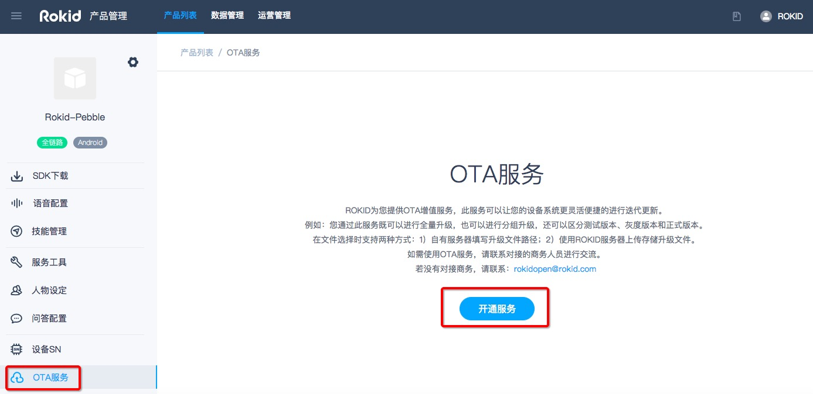
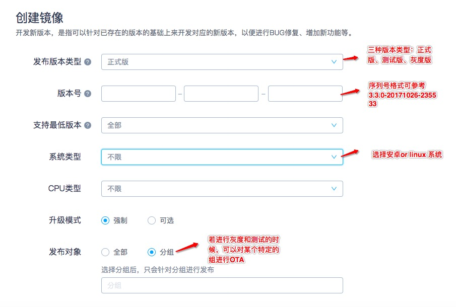
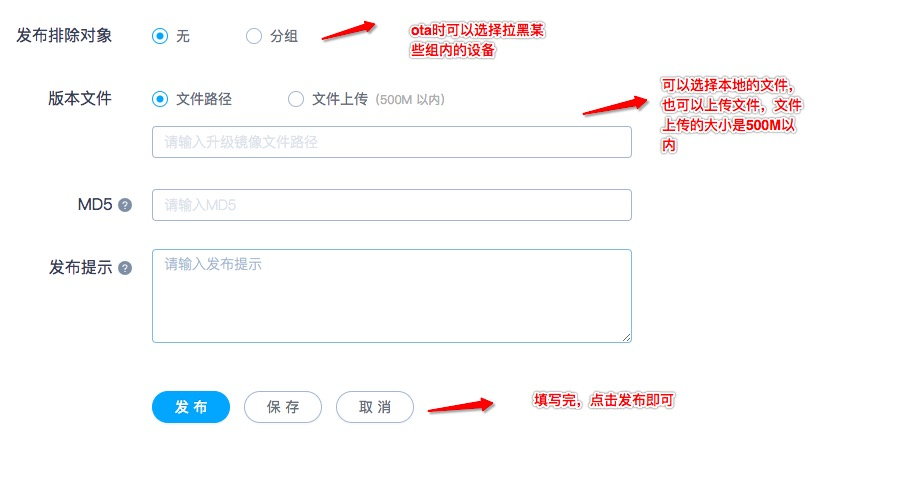
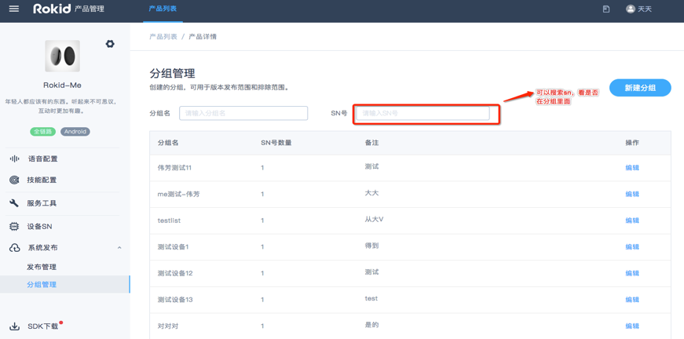

## 目录

本文介绍如何通过“Rokid开放平台”对设备进行系统升级。

* [一、系统发布服务](#一、系统发布服务)
* [二、系统发布流程](#二、系统发布流程)
* [三、分组管理](#三、分组管理)

### 系统发布服务

可通过此服务既可以进行全量升级，也可以进行分组升级，还可以区分测试版本、灰度版本和正式版本。在文件选择时支持两种方式：1）自有服务器填写升级文件路径；2）使用ROKID服务器上传存储升级文件。如需使用OTA服务，请联系对接的商务人员进行交流。若没有对接商务，请联系：rokidopen@rokid.com

### 系统发布流程

- 点击页面【新建版本】，即可进入系统版本发布的页面。按照页面的要求，填写好发布对象、文档路径（选择自有服务器orROKID服务器）、MD5值等。
备注：不同的版本的发布次数是有限制的呢，请注意与商务沟通次数问题。

- 备注：MD5的典型应用是对一段Message(字节串)产生fingerprint(指纹)，以防止被“篡改”。举个例子，你将一段话写在一个叫 readme.txt文件中，并对这个readme.txt产生一个MD5的值并记录在案，然后你可以传播这个文件给别人，别人如果修改了文件中的任何内容，你对这个文件重新计算MD5时就会发现（两个MD5值不相同）。
发布完成后，若用户设备在线的时候，如果我们强制升级的话，设备会自动进行升级，如果用户设备没有在线，重新配网的同时，自动升级。

### 分组管理

- 分组管理是用来管理用户的，可以通过分组管理针对部分用户进行灰度或者测试。

