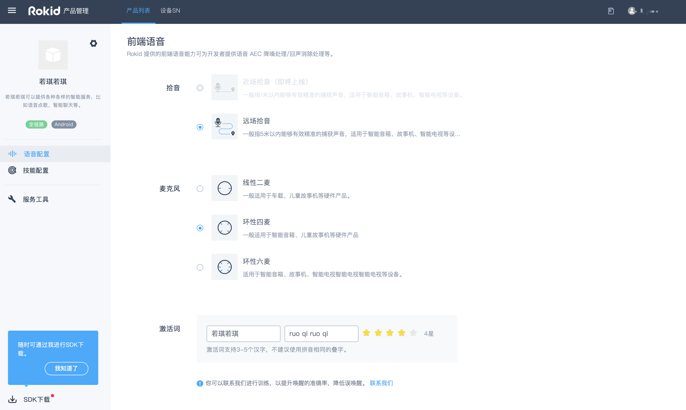
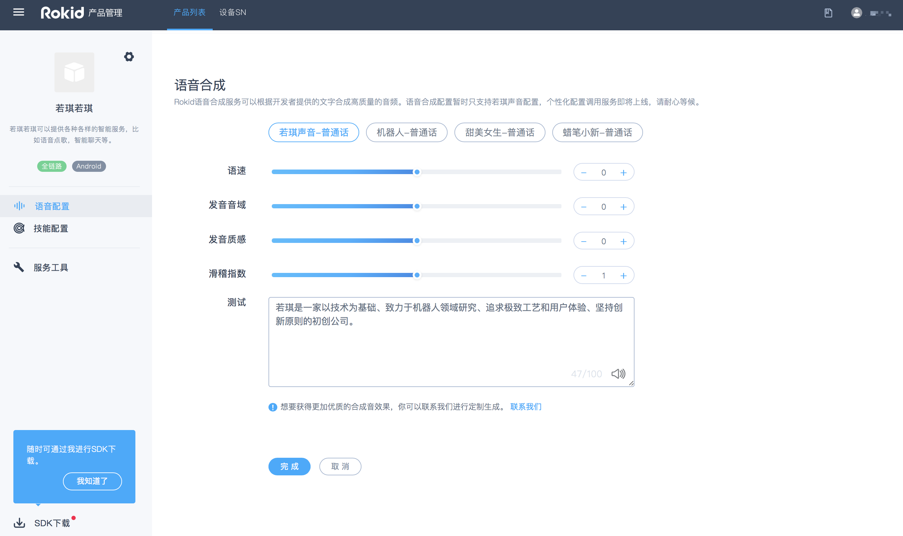
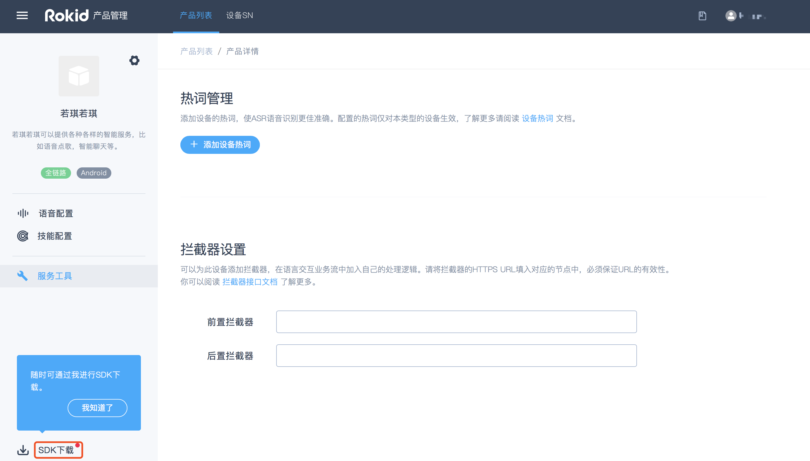
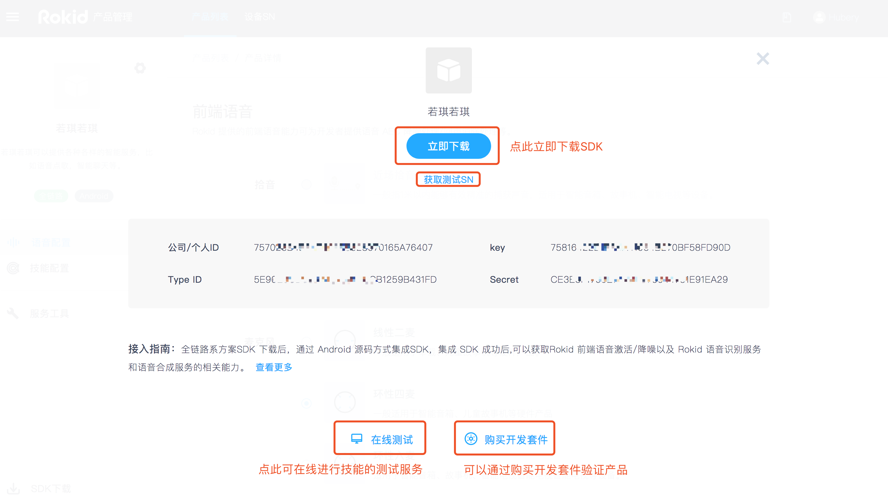

### 目录

* [一、创建和配置产品](#一、创建和配置产品)
  * [登录平台账号](#登录平台账号)
  * [创建产品](#创建产品)
  * [配置产品](#配置产品)
* [二、获取SDK](#二、获取sdk)
* [三、设备SN导入和管理](#三、设备SN导入和管理)
  * [获取测SN](#获取测试序列号)
  * [导入正式SN](#导入正式序列号)
* [四、认证文件使用方法](#四、认证文件使用方法)
  * [直接调用API时的配置方法](#直接调用api时的配置方法)
  * [使用C++ SDK时的配置方法](#使用c++sdk时的配置方法)

### 一、创建和配置产品

#### 登录平台账号
**若尚未有账号请先注册**

要使用Rokid开放平台的语音整体方案，请先点击[Rokid开放平台](https://developer.rokid.com/#/)首页右上方的【登录】按钮，登录Rokid开放平台。如果未有账号，则点击旁边的【注册】按钮进行注册。如下图所示。


登录以后，即进入了Rokid开放平台的控制台。首先您需要勾选【同意并接受该协议所有内容】以同意开发者社区服务协议，并点击确定。如下图所示。


然后选择语音整体方案，点击【立即接入】，即可开始使用语音接入工具。如下图所示。


#### 创建产品

产品是指您想要接入Rokid语音服务的一种设备，一个产品只对应一种语音配置。当您想要实现多种语音效果的时候，需要创建多个产品。

在上一步点击【语音接入】后，就可以进入创建产品的页面。

- 首次创建产品，可以查看到【创建流程】，点击【一键接入】即可进行创建产品。 如下图所示。
  

- 若账号下已有创建过的产品，则可以点击页面右上角的【一键接入】创建新的产品。如下图所示。

  


##### 填写产品基本信息

需要填写的产品基本信息，包括：【方案类型】、【系统类型】、【产品名称】、【产品描述】、【产品图片】。

**注意：**【方案类型】分为 [**全链路通用方案**](./fullLink/fulllink.md) 和 [**基础语音模块**](./speechTTS/speechtts.md) 两种。两者的主要区别是：全链路方案会包含前端模块（拾音方式和mic阵列），基础语音模块不包含前端模块（拾音方式和mic阵列）。


#### 配置产品

##### 语音配置

###### 1)前端语音配置

可根据硬件产品选择【拾音方式】、【麦克风阵列】，并进行【激活词】的设置。如下图所示。

###### 激活词

**`激活词`**也即**`唤醒词`**，默认为若琪若琪，该激活词已经进行训练，唤醒率比较高，测试时为了保障效果建议使用若琪若琪。

设置自定义激活词请单击**`激活词`**后面的第一个输入框进行编辑；**`激活词`**支持3-5个汉字，不建议使用拼音相同的叠字，**`激活词`**的评分需在3星以上才能保存。

若您选择了自定义**`激活词`**，为了提高唤醒率，建议联系商务(商务邮箱:rokidopen@rokid.com)申请数据训练。




###### 2)语音合成配置

当前页面下拉可以配置语音合成。目前只支持【若琪声音-普通话】的调用，其他合成音暂时只能进行在线试听，个性化配置调用会在后期上线。 




##### 技能配置

接下来，可以进行技能的添加和申请。

###### 技能分类

Rokid平台上的技能根据开放性的不同，可以分为**`公开技能`**和**`私有技能`**。

<table>
    <tr>
        <th>技能分类</th>
        <th>技能描述</th>
    </tr>
    <tr>
        <td width="30%" align="center">公开技能</td>
        <td width="70%">公开技能将会对所有搭载Rokid语音解决方案的设备开放，用户可以通过技能商店轻松开启公开技能</td>
    </tr>
    <tr>
        <td width="30%" align="center">私有技能</td>
        <td width="70%" word-wrap: break-word;word-break:break-all;>私有技能无法向所有用户开放，仅针对经过授权的企业或个人的特定类型的设备开放。用户需要在被授权的设备上才能够使用私有技能。</td>
    </tr>
</table>


<h6 id="1-3-2-2">技能配置页面介绍

技能配置页面，共有【技能商店】、【我创建的技能】、【已选技能】三个选项卡。

###### 技能商店

【技能商店】是平台展示各类技能的地方 。目前只展示公有技能和rokid私有技能 。您可以添加公有技能，也可以添加自己创建的技能，但是添加rokid私有技能需要联系商务(商务邮箱:rokidopen@rokid.com)授权。

若您想要添加自己创建的技能，目前有两种方法： 一种是在自己创建的技能页面的发布页面，添加设备typeid，若为公有技能，添加设备id后即可生效，若为私有技能，需前往语音接入的服务配置页面，接受授权。另一种是在语音接入的服务配置页面添加自己创建的技能 。（创建技能的具体步骤，请参考：[技能创建与发布](2-RokidDocument/1-SkillsKit/getting-started/create-and-pulibsh.md)）


###### 我创建的技能

【我创建的技能】为当前账号创建的已发布技能。

###### 已选技能

【已选技能】为当前账号通过技能商店添加申请的以及自行创建的所有技能。该选项卡下，您可以查看申请技能的状态，以及选择启用或禁用某项技能。


###### 具体配置操作

- 公有技能可以直接进行添加。

- 页面上展示的Rokid自有技能，您可以在页面上提出申请，由商务(商务邮箱:rokidopen@rokid.com)同意授权后即可使用。

- 技能配置页面上未显示的Rokid自有技能（系统技能），如有需要，请您提供**typeID**（typeID是该类型产品的唯一标识），然后由商务(商务邮箱:rokidopen@rokid.com)协助进行人工授权，授权后您同意授权即可使用。

  **注意**：添加的本地技能（包括系统技能），需要设备厂商进行二次开发。

  > 如：计时器、闹钟、提醒、定时休眠、系统音量、系统电量、系统设置、系统灯光、系统升级、系统powermanager（休眠指令）、系统语音开关、系统引导、系统蓝牙等。


##### 服务工具配置

服务工具的配置，包括热词和拦截器配置。热词主要为了提升识别率；拦截器主要适用于兜底聊天和技能家居服务。 具体参照以下指南：

[热词管理接入指南](https://developer.rokid.com/docs/5-enableVoice/rokid-vsvy-sdk-docs/important-concept.html)

[拦截器设置接入指南](https://developer.rokid.com/docs/3-ApiReference/rokid-interceptor.html)


### 二、获取SDK

完成产品的创建和配置后，即可获取产品的SDK。获取SDK有如下两种方式。

#### 方式一

在【产品列表】页面下，选择相应的产品选项卡，点击选项卡右下角的下载图标，即可下载产品SDK。如下图所示。


#### 方式二

在产品的编辑页面，点击页面左下角【SDK下载】即可获取产品的SDK。


点击后会弹出如下页面，接下来就可以进行下载SDK，获取测试序列号，进行产品的在线测试等操作。如下图所示。



### 三、设备SN导入和管理
####  设备SN导入
- 什么是SN和测试SN

SN为产品的序列号，即设备ID(device_id),设备的唯一标识项，是进行Rokid设备认证和Rokid平台服务认证的基础参数。产品使用Rokid语音服务，需要进行SN导入。导入成功后，即该SN对应的设备成功授权，设备可以正式使用Rokid语音交互服务。
SN为厂商根据自己的实际情况来定义，支持数字、字母，且字母区分大小写（比如SN00001和sn00001，为两个不同的sn号）。

测试SN，主要用于测试期间使用Rokid设备认证和获取平台服务。
平台提供10个免费测试SN用于产品验证阶段测试使用，正式发布请联系Rokid(rokidopen@rokid.com)申请正式自有SN的导入权限。


- 设备TypeID和设备ID(device_id，即SN)的区别

设备typeID是同一类型硬件产品的共有id，而设备ID则为该类型产品下单个设备的唯一id。技能授权仅与typeID有关，与设备id无关，用户提供typeID获取了技能授权后，该typeID下的所有设备均可使用这些技能。

> 如：Rokid Pebble的typeID为95XXXXXX，但每一台pebble都有自己的id（sn号）。

- 什么是 seed，在什么情况下需要使用 seed

seed为设备登录换取设备类型的key和secret的密钥。如果厂商不使用设备登录模块，这可以不依赖seed。

- 获取测试 SN

产品管理页面，点击左侧导航中的【设备SN】，即可看到10个默认提供的测试SN号。


###### 每个测试sn号对应的seed，可以通过点击进入【导入记录】来下载。


若想要申请更多的测试序列号，请联系商务（商务邮箱：rokidopen@rokid.com）。


#### 导入正式 SN

测试完成后，若想正式使用Rokid服务，需要导入正式SN。

正式序列号需要联系商务（商务邮箱：rokidopen@rokid.com）签订合同后才能获取导入资格。**邮件内容请写明：公司名称、联系方式、申请导入SN数量。**商务授权后即可导入正式 SN。导入正式序列号后，Rokid 开放平台即对这批 SN 设备进行授权，这批设备即可正式使用 Rokid 语音交互服务。

- 具体操作

进入【产品列表】页面，然后进入想要导入SN的产品页面，点击【设备SN】，并按照指定模板导入即可。如下图所示：


下载模板，按照模板格式来编写文件。模板中，有三列，分别为SN、Seed、Mac，且提供了一个例子。其中，SN列，必填；Seed列，当您无seed或者不需要seed时，此列可不必填写，rokid会为sn生成对应的Seed（在导入记录中下载）；Mac列，非必填，当业务需要时填写。
导入完成后，页面会提示导入是否成功。同时，在【导入记录】中也会新增每次导入的记录和错误反馈。在10分钟后，该批设备即可使用平台的语音服务。客户可以在页面的【类别选择】中选择【正式】类别查看自己导入的sn号。


**注意：**当Seed不填为空时，依旧保留该列，保留占位符，方便正确读取每列的信息，若导入的sn号有重复，系统会自动对其进行去重，重复的sn号不计算在总的sn号数量里。一次最多支持5万个sn号的导入。


### 四、认证文件使用方法

#### 直接调用API时的配置方法

直接通过API调用Rokid语音服务时，按照[Rokid开发者社区接口文档](/3-ApiReference/openvoice-api.md)中的要求，填入相应的参数即可。
其中提到的`key` `secret` `account_id` `device_type_id`均通过开放平台语音接入 SDK 下载页面获得。

但需要注意，device_id需要由开发者自行指定，由字母和数字组成，不能含有空格和特殊符号。此ID每个设备唯一。

#### 使用C++ SDK时的配置方法

通过调用SDK中的config方法来配置认证信息：

```c++
void config(String key, String value)
```

同样的，`device_id`需要开发者自行指定，用以区分每个不同的设备。

具体请查看[Rokid客户端SDK文档中的示例](/3-ApiReference/rokid-client-sdk-doc.md)。

#### 在Android设备上使用TTS、Speech SDK时的配置方法

##### TTS SDK
SDK解包后`etc`目录下文件最终需要放到安卓设备的`/system/etc`目录下。
其中`tts_sdk.json`提供TTS SDK需要的配置信息，包括连接服务器的认证信息。

首先需要将创建认证文件中获得的认证信息填入到此文件中，具体需要修改如下几项：
`key` `secret` `device_type_id` `device_id`

再将`tts_sdk.json`文件push到设备中：

```text
cd etc
adb push . /system/etc/
```