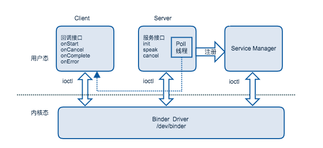

# TTS

我们的语音合成接口使用 C/S 架构，服务端默认启动，开发者需要通过调用客户端接口与服务端通讯，TTS服务架构图如下：



客户端头文件目录位于：

```c
#include <tts/tts_client.h>
```

除了要 `include` 头文件外，还需要链接 `-lrktts`。

## API

```c
int tts_init(); 
// tts初始化接口

int tts_speak(const char* content, void* userdata); 
// tts播放接口，参数content：要播放内容，userdata：用户私有数据

void tts_cancel(int id, void* userdata);
// tts取消借口，参数id：代表要取消的tts的id，userdata：用户私有数据

void tts_set(struct tts_callback *func);
// tts设置的接口，参数func代表要实现的接口

void tts_destroy();
// tts退出接口
```

## 回调接口

```c
void (*onStart)(int id, void* userdata);
// tts服务开始事件

void (*onCancel)(int id, void* userdata);
// tts服务取消事件

void (*onComplete)(int id, void* userdata);
// tts服务结束事件

void (*onError)(int id, int err, void* userdata);
// tts服务出错事件
```

## 示例

```c
#include <tts/tts_client.h>

void onStart(int id, void* userdata) {
}
void onCancel(int id, void* userdata) {
}
void onComplete(int id, void* userdata) {
}
void onError(int id, int err, void* userdata) {
}

int main(int argc, char** argv) {
  int id;
  int complte;
  tts_callback_t func = {
    onStart, onCancel, onComplete, onError
  };
  tts_init();
  tts_set(&func);
  id = tts_speak((const char *)argv[1], &complte);
  return 0;
}
```


